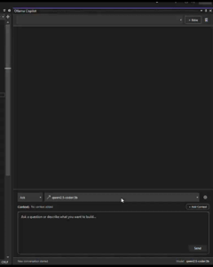
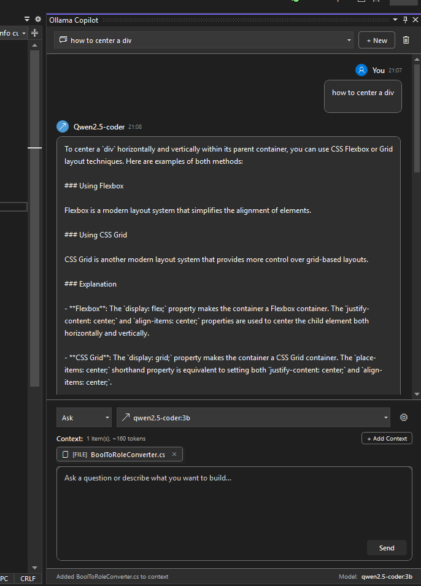
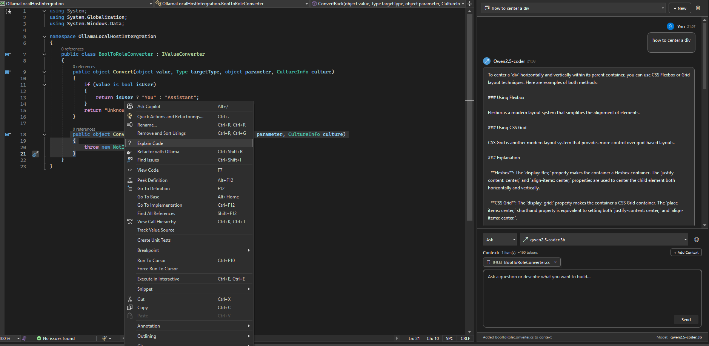

# Ollama Copilot — Visual Studio 2022 Extension

**A privacy-first AI coding assistant powered by Ollama, running entirely on your own hardware.** Get intelligent code explanations, issue detection, refactoring suggestions, and free-form chat — all without sending a single line of code to the cloud.

[](https://visualstudio.microsoft.com/)
[](https://dotnet.microsoft.com/)
[](LICENSE.txt)




---

## Table of Contents

- [Features](#features)
- [Screenshots & Media](#screenshots--media)
- [Quick Start](#quick-start)
- [Ollama Setup](#ollama-setup)
- [Usage Guide](#usage-guide)
- [Context System](#context-system)
- [Code Templates](#code-templates)
- [Conversation History](#conversation-history)
- [Configuration](#configuration)
- [Troubleshooting](#troubleshooting)
- [Architecture](#architecture)
- [Privacy & Security](#privacy--security)
- [Contributing](#contributing)
- [License](#license)

---

## Features

### Intelligent Chat Interface
- Copilot-style chat panel docked inside Visual Studio
- Real-time **streaming responses** — tokens render word-by-word as the model generates
- **Stop button** — cancel any in-progress request instantly; partial responses are preserved
- Rich message rendering with automatic code-block detection, syntax headers, and one-click **Copy** buttons
- User / Assistant message alignment with avatars, model name badges, and timestamps
- Conversation list dropdown — switch between past conversations instantly

### Context-Aware Prompts
Attach rich context to any message so the model sees exactly the code you're talking about:

| Context Type | What It Adds |
|---|---|
| **Active Document** | Full text of the currently open file |
| **Selection** | Highlighted code in the editor |
| **Whole Solution** | A summary of every file, organised by project |
| **Search Files** | Pick specific files from a filterable solution search |
| **Search Classes** | Find and attach classes / interfaces |
| **Search Methods** | Find and attach methods / properties |

Context items appear as dismissible **chips** in the input area showing type, icon, and name.

### Editor Commands (Right-Click Menu)
Select code in the editor and use the **Ollama Copilot** context menu or keyboard shortcuts:

| Command | Shortcut | Description |
|---|---|---|
| Explain Code | `Ctrl+Shift+E` | Get a detailed explanation of the selected code |
| Find Issues | `Ctrl+Shift+I` | Analyse for bugs, security issues, and code smells |
| Refactor with Ollama | `Ctrl+Shift+R` | Receive refactoring suggestions |
| Open Ollama Copilot | `Ctrl+Shift+O` | Toggle the chat tool window |
| Stop Request | `Esc` | Cancel the current streaming response |

### 10 Built-In Code Templates
Jump-start common tasks with pre-built prompt templates:

| Template | Category |
|---|---|
| Generate Unit Tests | Testing |
| Generate Documentation | Documentation |
| Add Logging | Debugging |
| Convert to Async | Refactoring |
| Add Error Handling | Quality |
| Optimize Performance | Optimization |
| Security Review | Security |
| Code Review | Quality |
| Implement Interface | Code Generation |
| Apply Design Pattern | Architecture |

### Conversation History
- Conversations are automatically saved to disk
- Browse, switch between, and delete past conversations from the header dropdown
- Auto-generated titles based on first message
- **Export to Markdown** for sharing or archival

### Diff Preview
When the model suggests code changes you can review them before touching your files:
- **Side-by-side diff** via Visual Studio's native diff viewer
- **Unified diff** view with `+`/`-` line indicators
- **Change statistics** — lines added, removed, and modified
- Accept or discard from the diff window

### Multi-Model Support
Ollama Copilot auto-detects every model installed on your Ollama server. Switch models mid-conversation from the dropdown — popular choices include:

| Model | Size | Strength |
|---|---|---|
| `qwen2.5-coder` | 4.7 GB | Fast, strong code generation |
| `codellama:7b` | 3.8 GB | Solid general code tasks |
| `deepseek-coder:6.7b` | 3.8 GB | Excellent code completion |
| `llama3:8b` | 4.7 GB | Good general-purpose chat |
| `mixtral:8x7b` | 26 GB | Complex reasoning |

> Any model available via `ollama list` will appear automatically — no manual configuration needed.

---


## Screenshots & Media

**Hero overview:**


**Editor context menu:**


**Full workflow GIF:**


---

## Quick Start

### Prerequisites
- **Visual Studio 2022** (Community, Professional, or Enterprise)
- **Ollama** installed and running — [ollama.com/download](https://ollama.com/download)
- At least **one model** pulled (e.g. `ollama pull qwen2.5-coder`)

### Install from VSIX
1. Download the latest `.vsix` from [Releases](https://github.com/your-username/ollama-copilot-vs/releases)
2. Double-click the file — Visual Studio Installer will handle the rest
3. Restart Visual Studio

### Build from Source
```bash
git clone https://github.com/your-username/ollama-copilot-vs.git
cd ollama-copilot-vs
```
Open `OllamaLocalHostIntergration.sln` in Visual Studio 2022, restore NuGet packages, and press **F5**. An experimental VS instance will launch with the extension loaded.

---

## Ollama Setup

### Local (Same Machine)

1. **Install Ollama** — download from [ollama.com/download](https://ollama.com/download).
   On Windows, Ollama installs as a background service and starts automatically.

2. **Pull a model:**
   ```bash
   ollama pull qwen2.5-coder
   ```

3. **Open Ollama Copilot** in VS (`Ctrl+Shift+O`) — the default server address `http://localhost:11434` works out of the box. Your models will appear in the dropdown.

### Remote (Network Server)

<details>
<summary>Click to expand remote setup instructions</summary>

#### On the server

```bash
# Listen on all interfaces
export OLLAMA_HOST=0.0.0.0:11434
ollama serve

# Open firewall
sudo ufw allow 11434/tcp   # Ubuntu/Debian
```

To persist across reboots, add the environment variable to `~/.bashrc` or configure the systemd unit:

```bash
sudo systemctl edit ollama.service
# Add under [Service]:
# Environment="OLLAMA_HOST=0.0.0.0:11434"
sudo systemctl daemon-reload && sudo systemctl restart ollama
```

#### On your dev machine

1. Open Ollama Copilot → click the **gear** icon
2. Set the server address to `http://<SERVER_IP>:11434`
3. Models will auto-populate after the address is saved

**Quick connectivity test:**
```powershell
curl http://<SERVER_IP>:11434/api/tags
```

</details>

---

## Usage Guide

### Chat
1. Press `Ctrl+Shift+O` to open the tool window
2. *(Optional)* Attach context — click **Add Context** and choose what the model should see
3. Type your message and press **Enter** (`Shift+Enter` for a new line)
4. The response streams in real time with formatted code blocks
5. Click the **Stop** button or press **Esc** to cancel a response mid-stream — any partial output is kept

### Explain Code
1. Select code in the editor
2. `Ctrl+Shift+E` or right-click → **Ollama Copilot** → **Explain Code**
3. The tool window opens and streams an explanation

### Find Issues
1. Select code
2. `Ctrl+Shift+I` or right-click → **Find Issues**
3. The model analyses the code for bugs, security flaws, and code smells

### Refactor Code
1. Select code
2. `Ctrl+Shift+R` or right-click → **Refactor with Ollama**
3. Review the suggested changes; use the diff preview to compare before applying

---

## Context System

The context system lets you give the model visibility into your codebase beyond the current chat message.

### Adding Context
Click **Add Context** in the input area to open the type selection dialog:

- **Active Document** / **Selection** — instant, no search needed
- **Whole Solution** — generates a structure summary of all projects and files
- **Search Files / Classes / Methods** — opens a filterable search dialog powered by the VS code model

### Context Chips
Each attached item appears as a chip showing its type icon (e.g. `[FILE]`, `[CLASS]`), display name, and a remove button. Context is serialised into labelled code blocks in the prompt sent to Ollama.

### Auto-Add Active Document
By default the extension automatically attaches the currently open file as context. This can be toggled off in settings.

---

## Code Templates

Templates provide pre-crafted prompts for common coding tasks. Select a template, and the extension fills in the prompt with your selected code automatically.

| Template | Category | What It Does |
|---|---|---|
| Generate Unit Tests | Testing | Creates unit tests for the selected code |
| Generate Documentation | Documentation | Writes XML doc comments / summaries |
| Add Logging | Debugging | Inserts logging statements at key points |
| Convert to Async | Refactoring | Converts synchronous code to async/await |
| Add Error Handling | Quality | Wraps code with try/catch and validation |
| Optimize Performance | Optimization | Suggests performance improvements |
| Security Review | Security | Checks for common security vulnerabilities |
| Code Review | Quality | Provides a detailed code review |
| Implement Interface | Code Generation | Generates implementation for an interface |
| Apply Design Pattern | Architecture | Refactors code to use a design pattern |

---

## Conversation History

Conversations are automatically persisted as JSON files and survive between Visual Studio sessions.

- **Switch conversations** from the dropdown in the tool window header
- **Create new** conversations with the "New" button
- **Delete** conversations you no longer need
- **Export to Markdown** for documentation or sharing

Each conversation records: all messages, the model used, timestamps, and token counts.

---

## Configuration

Click the **gear icon** in the tool window to expand the settings panel.

| Setting | Default | Description |
|---|---|---|
| Server Address | `http://localhost:11434` | Ollama API endpoint (local or remote) |
| Selected Model | *(auto-detected)* | The model to use for responses |
| Auto-Add Active Document | On | Automatically attach the open file as context |

Settings are saved automatically when you change them.

---

## Troubleshooting

### Diagnostics Script
A built-in PowerShell script tests connectivity, model availability, and common misconfigurations:

```powershell
# Local
.\diagnose-ollama.ps1

# Remote
.\diagnose-ollama.ps1 -ServerAddress 192.168.1.100
```

### Common Issues

<details>
<summary><strong>No models appear in the dropdown</strong></summary>

- Make sure Ollama is running: `ollama serve`
- Pull at least one model: `ollama pull qwen2.5-coder`
- Check the server address in settings matches where Ollama is listening

</details>

<details>
<summary><strong>Connection refused (remote server)</strong></summary>

```bash
# Verify Ollama is listening on all interfaces
sudo ss -tlnp | grep 11434
# Should show 0.0.0.0:11434, NOT 127.0.0.1:11434

# If not, set the host and restart
export OLLAMA_HOST=0.0.0.0:11434
ollama serve
```

</details>

<details>
<summary><strong>Connection timeout</strong></summary>

```bash
# Check firewall
sudo ufw status
sudo ufw allow 11434/tcp

# Test from Windows
ping <SERVER_IP>
curl http://<SERVER_IP>:11434/api/tags
```

</details>

<details>
<summary><strong>Slow responses</strong></summary>

- Use a smaller model (7B parameters or fewer) for faster generation
- Ensure the server has adequate RAM / VRAM for the chosen model
- Reduce attached context to lower token counts

</details>

---

## Architecture

```
OllamaLocalHostIntergration/
├── Commands/               # Editor context-menu commands
│   ├── ExplainCodeCommand
│   ├── FindIssuesCommand
│   ├── RefactorCodeCommand
│   └── MyToolWindowCommand
├── Controls/               # WPF user controls
│   ├── RichChatMessageControl    # Message bubble with code blocks
│   ├── ContextChipControl        # Dismissible context tag
│   └── PendingChangeControl      # Code-edit review card
├── Converters/             # WPF value converters (alignment, icons, visibility)
├── Dialogs/                # Modal dialogs
│   ├── ContextSearchDialog       # Solution-wide code search
│   ├── ContextTypeSelectionDialog# Context type picker
│   └── DiffPreviewDialog         # Fallback diff viewer
├── Models/                 # Data models (ChatMessage, CodeBlock, ContextReference, Conversation, …)
├── Services/               # Core logic
│   ├── OllamaService             # HTTP client — streaming chat, model listing
│   ├── CodeEditorService         # VS editor read/write via DTE
│   ├── CodeSearchService         # Solution-wide file/class/method search
│   ├── ConversationHistoryService# Save/load/export conversations
│   ├── FileContextService        # Multi-file context builder
│   ├── MessageParserService      # Markdown → code block extraction
│   ├── PromptBuilder             # Context-aware prompt construction
│   ├── SettingsService           # Persist settings via VS settings store
│   ├── TemplateService           # Built-in code templates
│   ├── VSDiffService             # Native VS diff viewer integration
│   └── …
└── ToolWindows/            # Tool window host
```

### Key Design Decisions
- **Streaming-first** — all chat responses use Ollama's `/api/chat` endpoint with `stream: true` for a responsive feel
- **Cancellable requests** — every streaming call supports `CancellationToken`, wired to the Stop button and `Esc` key
- **VS-native diff** — code changes open in Visual Studio's built-in diff viewer via `IVsDifferenceService`
- **DTE2 code model** — context search uses VS's own code model to find classes, methods, and files without external parsers
- **Local persistence** — conversations and settings are stored on disk, never uploaded

---

## Privacy & Security

| Principle | Detail |
|---|---|
| **No cloud** | All inference runs on your Ollama instance — local or on your own network server |
| **No telemetry** | The extension collects zero usage data |
| **No external calls** | The only network traffic is between VS and your Ollama endpoint |
| **Open source** | Every line of code is auditable in this repo |

> **If exposing Ollama to the internet**, place it behind a reverse proxy with authentication and TLS. Ollama has no built-in auth.

---

## Contributing

Contributions are welcome — issues, feature requests, and pull requests.

### Development Setup
1. Clone the repo
2. Open `OllamaLocalHostIntergration.sln` in Visual Studio 2022
3. Restore NuGet packages
4. Press **F5** — an experimental VS instance launches with the extension loaded

### Code Style
- Follow standard C# conventions
- XML-doc public APIs
- Keep methods focused and single-responsibility

---

## License

MIT — see [LICENSE.txt](LICENSE.txt).

---

## Acknowledgements

- [Ollama](https://ollama.com) — local LLM runtime
- [Visual Studio Community Toolkit](https://github.com/VsixCommunity/Community.VisualStudio.Toolkit) — extension development helpers
- The open-source model community (Qwen, CodeLlama, DeepSeek, Llama, Mixtral)

---

**Built for developers who want AI assistance without giving up their code privacy.**
